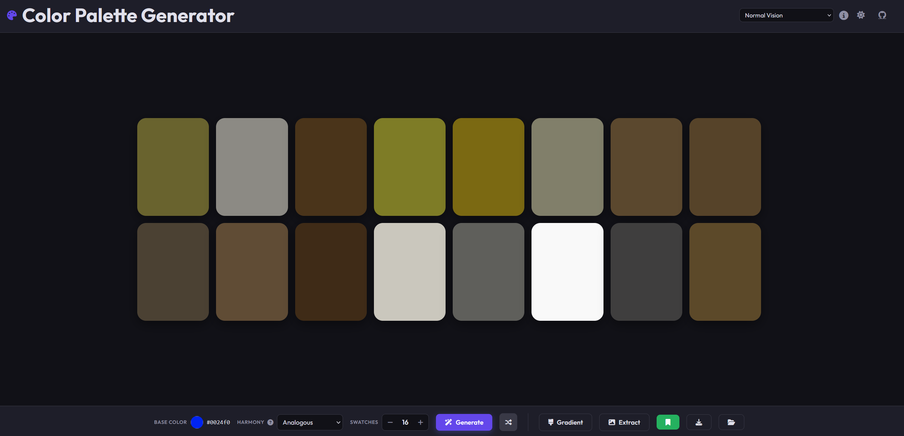
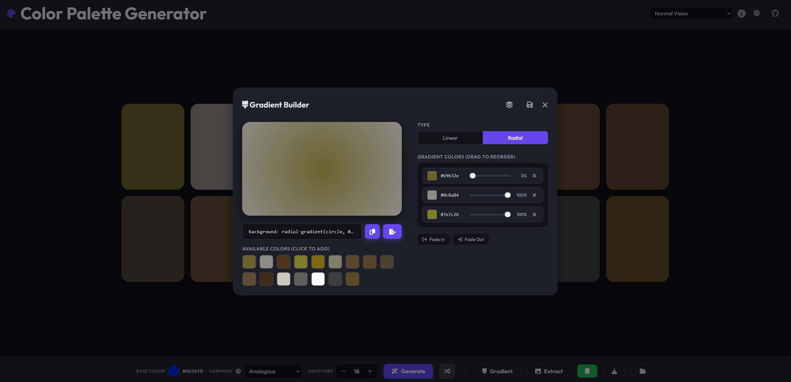
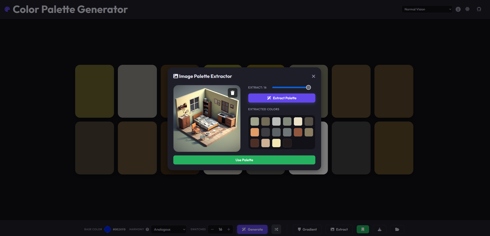

# Color Palette & Gradient Tool Generator

A client-side web application designed for designers, and developers to create, refine, and export color palettes and gradients.

## 🚀 Features

### 🎨 Palette Generation
- **Intelligent Harmonies**: Generate palettes using Analogous, Monochromatic, Triadic, Tetradic, Complementary, and Split-Complementary strategies.
- **Precision Editing**: Manually adjust HEX, RGB, or HSL values with real-time feedback.
- **Lock & Shuffle**: Lock your favorite colors and generate new ones around them.
- **Visual Reordering**: Drag and drop swatches to perfect your arrangement.

### 🌈 Gradient Builder
- **Linear & Radial**: Create complex gradients with up to 5 color stops.
- **Perceptual Accuracy**: Advanced K-Means clustering in CIELAB space for extracting dominant tones from images.
- **Transparency Controls**: Dedicated "Fade In" and "Fade Out" utilities.
- **Live Preview**: See your gradient update in real-time on a large canvas.

### 🖼️ Image Extraction
- **Drag & Drop / Paste**: extract palettes directly from images.
- **K-Means Clustering**: Perceptually uniform color grouping in CIELAB space.
- **Customizable Output**: Extract between 3 and 16 dominant colors.

### ♿ Accessibility & Utilities
- **Contrast Checking**: Real-time WCAG 2.1 contrast ratio validation.
- **Color-Blind Simulation**: Preview your palette in Protanopia, Deuteranopia, and Tritanopia modes.
- **Persistence**: Automatic saving to `localStorage`.

### 📤 Multi-Format Export
- **CSS**: Copy variables, classes, or full gradient properties.
- **Images**: Download PNG or SVG versions of palettes and gradients.

## 🛠️ Technology
- **Vanilla JavaScript (ES6+)**: Core logic and state management.
- **Vanilla CSS**: Modern layout with Flexbox and CSS Grid.
- **Canvas API**: For high-quality image extraction and asset generation.
- **No Dependencies**: Lightweight and fast with zero external JS libraries.

## 📄 License
This project is licensed under the MIT License - see the [LICENSE](LICENSE) file for details.
